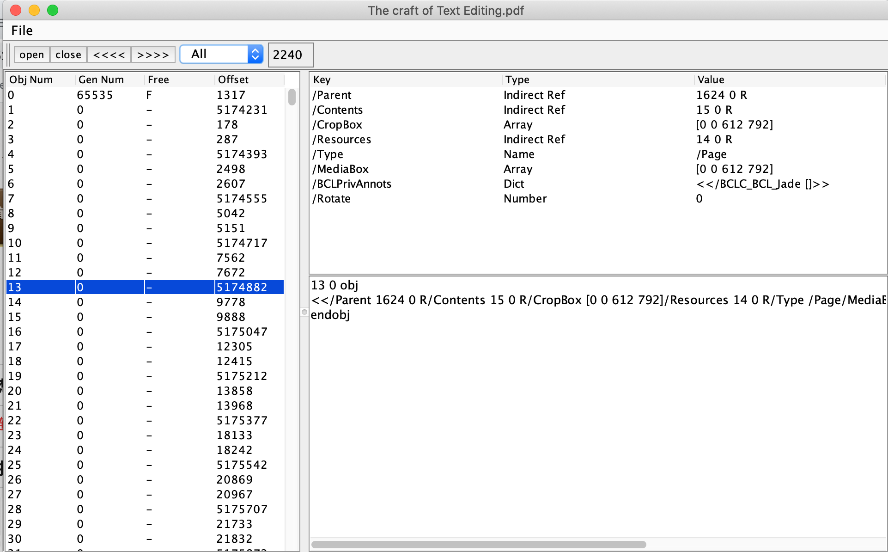
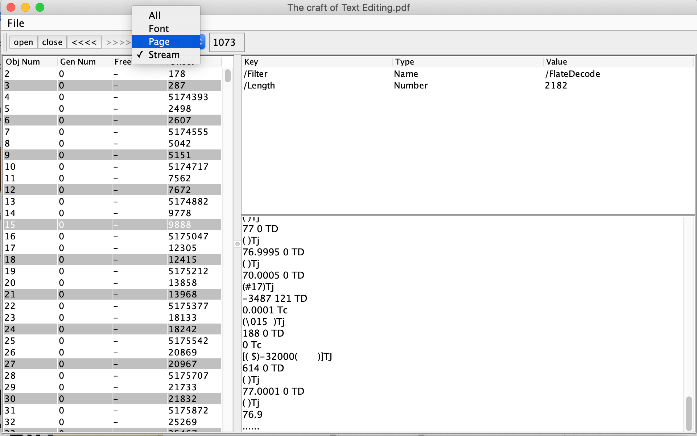

sledge
======

A java-based PDF tool
Sledge is a tool that can list PDF file objects and supports decoding of stream objects. You can use it to quickly analyze the internal structure of a PDF file.

Usage
-----
    Download standalone execuable jar: https://github.com/lumpchen/sledge/blob/master/dst/sledge.jar
    Usage: java -jar sledge.jar

Sledge 是一个可以列出PDF文件objects的工具，支持stream object的decode。可以用来快速分析一个PDF文件的内部结构。

--Mike Li lumpchen@163.com
